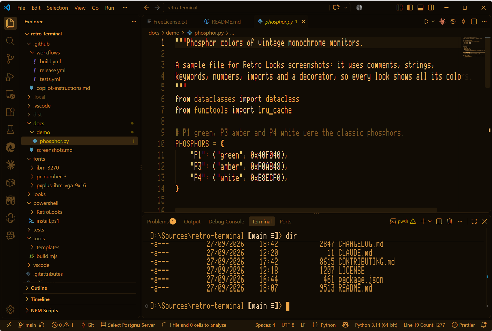

# Retro Looks

Vintage computer looks for **VS Code** and **Windows Terminal**: period-correct fonts and color schemes
from the machines we grew up on. There are two independent parts: a VS Code extension and a PowerShell
module for Windows Terminal. Use either or both; they share the same fonts.



| Look | Font | What it looks like |
|---|---|---|
| **Apple //e** | PR Number 3 (the //e 80-column font) | A monochrome monitor in the phosphor color of your choice: green, amber, white, cyan, yellow or any RGB color |
| **IBM PS/2 VGA** *(Windows Terminal only)* | PxPlus IBM VGA 9x16 | The black DOS prompt with the 16 VGA colors |
| **IBM PS/2 Monochrome** *(Windows Terminal only)* | PxPlus IBM VGA 9x16 | The 8503 monochrome VGA display: the 16 colors become brightness levels, in the phosphor color of your choice |
| **IBM 3270** | IBM 3270 | Mainframe color terminal with the default ISPF editor highlighting |
| **IBM 3270 Monochrome** | IBM 3270 | A 3278-style monochrome terminal: ISPF's colors become normal and intensified text, in the phosphor color of your choice |

Want a Commodore 64, a classic Mac or a CP/M machine, or a VS Code version of the PS/2 look? [Add it!](CONTRIBUTING.md)

## VS Code

Install **Retro Looks** from the Marketplace (or Open VSX), then open the Command Palette
(`Ctrl+Shift+P`) and run **Retro: Choose Look…**, or one of the **Retro: …** commands directly.

- A look sets the color theme, the editor and terminal fonts, font size and cursor.
- **Monochrome looks** (Apple //e, IBM 3270 Monochrome) ask for their phosphor color: green, amber,
  white, cyan, yellow, or **Custom…** for any `#RRGGBB`. Change it later with
  **Retro: Set Phosphor Color…**. Each look remembers its own color (in the
  `retroLooks.phosphorColors` setting), and changing it is instant.
- **Retro: Off** puts back exactly what you had before. Your chosen colors are remembered for next time.
- **Retro: Degauss** does what the button on a CRT did: *thunk*, a hum, and a second of wobbling,
  swirling colors in the editor.
- On Windows, the extension offers to install its fonts when VS Code starts (for your user only,
  no admin needed), until you install them or choose **Don't Show Again**. You can also run
  **Retro: Install Fonts** (shown only while they're missing). Uninstalling the extension removes them
  too, unless Retro Looks for Windows Terminal still uses them.
- On macOS and Linux, run **Retro: Open Bundled Fonts Folder** and install the fonts with your
  system's font installer. Automatic installation there is on the [roadmap](CONTRIBUTING.md#roadmap-and-where-help-is-wanted).
- Works in Remote SSH, WSL and container windows: the extension runs on your local machine.
- **Before uninstalling, run Retro: Off.** Once the extension is gone it can't restore your theme and
  fonts: VS Code would fall back to its default theme and keep the retro font size and cursor.
  (Reinstalling and running **Retro: Off** fixes it; the extension remembers your original settings.)

The themes are also available on their own through the normal theme picker (`Ctrl+K Ctrl+T`), and
you can use any of the fonts with any theme. The extension's full page is [vscode/README.md](vscode/README.md).

## Windows Terminal

Windows Terminal support is the **RetroLooks PowerShell module**. Paste this into PowerShell:

```powershell
irm https://github.com/zmbq/vscode-retro/releases/latest/download/install.ps1 | iex
```

It installs the module for both PowerShell 7 and Windows PowerShell, then runs `Install-RetroLooks`,
which installs the fonts and adds the looks to Windows Terminal. (Installed the module another way, e.g.
with `Install-Module`? The first `look` offers to run the setup for you, and after an update it offers to
refresh it. You can always run `Install-RetroLooks` yourself.) Close all Windows Terminal windows and
reopen it. Then pick **Retro Looks** from Terminal's profile menu, or, in any PowerShell tab:

```powershell
look apple                 # this tab becomes an Apple //e tab (same folder, new session)
look apple -Color amber    # ... in amber
look 3270mono              # or: ps2, ps2mono, 3270 (Tab completes)
look -Off                  # back to a normal tab
color cyan                 # recolor this tab only: green, amber, white, cyan, yellow, or '#RRGGBB'
color 0A                   # DOS codes work too: 0A green, 0E yellow, 1F white on blue
color                      # back to the tab's default colors
color amber -SetAsDefault  # new tabs of this look open in amber
look apple -Color amber -SetAsDefault   # your default look: switches now, and is what `look` alone
                                        # and the Retro Looks profile open
Get-RetroLook              # list the looks
degauss                    # thunk, hum, swirling colors (-Quiet for no sound); also brings back
                           # colors Windows Terminal threw away
```

Each tab has its own colors, so an amber and a green Apple //e can sit side by side. `look` needs a new
tab because only a Windows Terminal profile can set a tab's font: it opens one in the current folder and
closes the old tab (its scrollback doesn't come along; `-KeepTab` keeps it). In VS Code's terminal, `look`
just points you to the extension, and `color` works for that session. In other terminals, `look` explains
that it needs Windows Terminal (and how to get it, if it isn't installed).

**Want Terminal to start in your retro look?** Terminal's menu gets one entry, **Retro Looks**, which
opens your default look. Choose it under Settings → Startup → Default profile. It keeps working when you
change your default look later: its ID never changes. (Terminal only re-reads its profiles when it
starts, so after a new default look, restart Terminal; a Retro Looks tab reminds you if you forget.
Color changes apply right away.) The module never changes Terminal's settings itself.

The individual looks don't clutter the menu; `Install-RetroLooks -ShowProfiles` adds them if you prefer
clicking. Pixel fonts are sized for your display scaling so they stay sharp (`-KeepFontSizes` skips
that). Nothing needs admin rights, and your `settings.json` isn't touched: the looks are added as a
[Terminal fragment](https://learn.microsoft.com/windows/terminal/json-fragment-extensions).

Windows Terminal resets colors set this way when you switch input languages (a known Terminal bug). A tab
re-applies its color at the next prompt, and after `color ... -SetAsDefault` and a Terminal restart, resets
land on your default color.

Programs that use exact RGB colors ("true color") bypass the palette, so `color` can't recolor those
parts; Claude Code, for example, has an ANSI-colors-only theme in `/theme`.

Prefer to read before you run? [Look at the installer](powershell/install.ps1) and
[the module](powershell/RetroLooks/RetroLooks.psm1), or download `retro-looks-powershell.zip` from the
[latest release](https://github.com/zmbq/vscode-retro/releases/latest), unzip it and run `install.ps1`.

To uninstall (fonts are kept if the VS Code extension still uses them; add `-RemoveFonts` to remove them anyway):

```powershell
& ([scriptblock]::Create((irm https://github.com/zmbq/vscode-retro/releases/latest/download/install.ps1))) -Uninstall
```

or, to keep the module and just remove the looks and fonts, `Uninstall-RetroLooks`.

On macOS and Linux, install the fonts (see above) and pick them in your terminal's settings. Retro
color schemes for iTerm2, Ghostty, WezTerm, kitty, Alacritty and others are on the
[roadmap](CONTRIBUTING.md#roadmap-and-where-help-is-wanted), and contributions are welcome.

## Tweaking colors

**Windows Terminal:** `color` takes any `#RRGGBB`, and `-SetAsDefault` keeps it. The monochrome looks also
come with a Terminal color scheme per preset (e.g. *Apple //e Amber*) if you'd rather build your own
profile in Terminal's Settings.

**VS Code:** for monochrome looks, just pick another color (any `#RRGGBB` works). To override
individual colors of the **IBM 3270** theme, use your `settings.json`:

```jsonc
"workbench.colorCustomizations": {
  "[IBM 3270]": { "editor.background": "#050505" }
},
"editor.tokenColorCustomizations": {
  "[IBM 3270]": { "comments": "#30C0E0" }
}
```

Don't do this for the monochrome themes: while one is active, the extension manages their entries in
these two settings to apply your phosphor color.

**Want a whole new machine?** Clone this repo and ask your AI assistant (Claude Code, GitHub Copilot, …)
to add it. The repo includes instructions for them ([AGENTS.md](AGENTS.md)), and monochrome looks only
need a font and a default color.

**Font size:** pixel fonts are only sharp when every font pixel covers a whole number of screen pixels.
On Windows, the extension reads your display scaling (and VS Code's zoom level) and picks the sharp
size closest to the look's size, e.g. 21.333 at 150% scaling, with a line height that keeps every line on
whole pixels too. Turn this off with the
`retroLooks.pixelPerfectFontSize` setting, or change `editor.fontSize` / `terminal.integrated.fontSize`
after applying a look.

## Credits and licenses

The code and themes are MIT licensed (see [LICENSE](LICENSE)). The fonts are the work of their authors
and are redistributed under their own licenses, included next to each font in [fonts/](fonts/):

- **PR Number 3**, Kreative Software, [Kreative Relay Fonts Free Use License](fonts/pr-number-3/LICENSE.txt)
- **PxPlus IBM VGA 9x16**, VileR, [The Ultimate Oldschool PC Font Pack](https://int10h.org/oldschool-pc-fonts/), [CC BY-SA 4.0](fonts/pxplus-ibm-vga-9x16/LICENSE.txt)
- **IBM 3270**, Ricardo Bánffy and contributors, [3270font](https://github.com/rbanffy/3270font), [BSD 3-Clause](fonts/ibm-3270/LICENSE.txt)

The ISPF colors follow the defaults documented in IBM's *ISPF Edit and Edit Macros* manual.

Retro Looks is a fan project. It is not affiliated with or endorsed by Apple, IBM or any other
company whose products it pays tribute to; their names are used only to describe the look.
